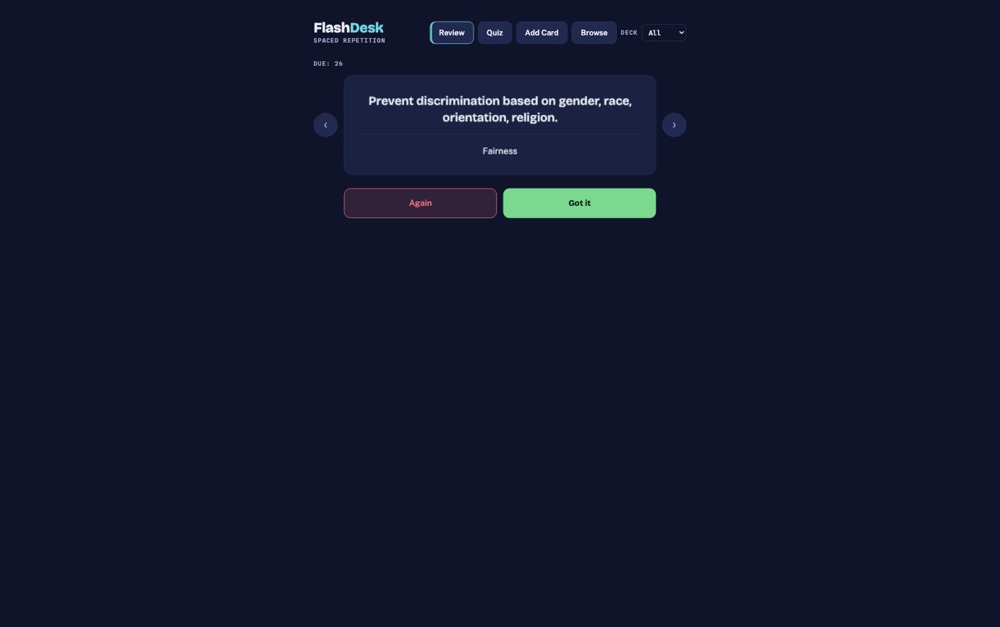

# FlashDesk

A local spaced-repetition flashcard web app built with zero npm dependencies. One Node process serves a vanilla JS front end and a small JSON API, and persists everything to a single JSON file next to the server.

It also ships as an **offline-first PWA**: the same UI with a localStorage adapter instead of the server, installable on a phone from https://apicad.github.io/flashdesk/ (Share → Add to Home Screen on iOS). After the first load it works with no network at all; cards and review state live on the device, with JSON export/import in the Browse tab for backup and transfer.

**Features**

- **Review mode** with tap-to-reveal cards, previous/next navigation, and two-button grading ("Again" / "Got it"). Full keyboard support: space to reveal, arrow keys to move, 1/2 or Enter to grade. Facts stored in both directions (term ↔ definition) collapse to one review per session, with a Keyword / Description / Mixed switch choosing which side shows first; grading updates both stored cards.
- **Quiz mode**: multiple-choice rounds (10/20/all questions) that can ask word → definition, definition → word, or a random mix per question. Distractors are ranked by word-overlap similarity and length-matched to the correct answer, so wrong options come from the same topic and no option stands out by length. Missed cards go straight back into the review queue.
- **Decks**: cards belong to named decks, with a global deck filter across every view.
- **Add and browse**: a quick-add form (Cmd/Ctrl+Enter to submit) and a browse table showing due time, streak, and lapse count per card, with two-click delete.
- **Copy stats**: one button copies a compact plain-text summary (deck sizes, cards due today, 7-day accuracy, most-lapsed cards) to the clipboard, formatted for pasting into an AI tutor chat.
- **Session log**: each finished review session or quiz appends one summary line to `~/drills/log.txt`.

## How the scheduling works

This is deliberately simpler than SM-2: no ease factors, no self-rated difficulty, just two buttons and a fixed interval ladder.

- **"Got it"** increments the card's streak and schedules it `[1, 3, 7, 14, 30, 60]` days out by streak count. Streaks past 6 stay at 60 days.
- **"Again"** resets the streak to 0, increments the card's lapse count, and brings it back in 10 minutes.
- **Quiz misses** make a card due immediately but leave streak and lapses untouched, so quiz rounds never distort the spaced-repetition stats.

## Tech stack

- Node.js standard library only (`node:http`, `node:fs`, `node:path`, `node:os`). No npm packages, no framework, no build step.
- Vanilla JavaScript, HTML, and CSS on the front end.
- Persistence: one JSON file (`flashdesk-data.json`), written atomically (write to a temp file, then rename). A corrupt data file is moved aside and the app re-seeds instead of crashing.

## Setup

Requires Node.js 16 or newer. There are no dependencies to install.

```sh
node server.js
```

Then open http://localhost:5902.

On first run the server seeds 26 sample cards (an AI-901 exam prep deck defined in `seed.js`) and creates `flashdesk-data.json`. That data file is gitignored; delete it any time to reset to the seed deck. Note that finished sessions are logged to `~/drills/log.txt` in your home directory.

## The PWA build

`docs/` is the static offline build, served by GitHub Pages. It is generated — never edit it by hand:

```sh
node build.js   # or: npm run build
```

The build copies `public/` into `docs/`, swaps in `pwa/store-local.js` as the storage adapter (localStorage + the same scheduling logic), injects the PWA head tags, bakes the current cards from `flashdesk-data.json` into `seed-data.js` (fronts and backs only, fresh review state), and stamps the service worker's cache name with a content hash so every deploy updates cleanly.

Deploy flow: edit `public/` or `pwa/` → `node build.js` → commit `docs/` → push. The site updates in a minute or two; an installed PWA picks the new version up on its next launch with network (a toast says when an update arrived).

Phone and desktop keep separate review state on purpose. To move cards either way, use Export / Import in the Browse tab of the PWA: it accepts a full export (replace) or a plain `[{front, back, deck}]` list (merge, duplicates skipped).

## Screenshot



## Design notes

- **Seed-on-first-run instead of a seed script.** `seed.js` just exports the starter cards; the server seeds automatically whenever the data file is missing. A fresh clone works with plain `node server.js`, and the same path doubles as recovery when the data file is unreadable.
- **Atomic saves.** Every write goes to `flashdesk-data.json.tmp` and is then renamed over the real file, so a crash mid-write cannot leave a half-written data file.
- **Keeping the quiz honest.** Quiz misses only move a card's due date; they never touch streak or lapse counts. That split keeps the interval ladder driven purely by real recall grades from review sessions.
- **Zero dependencies on purpose.** The whole app is an exercise in how far `node:http` plus vanilla JS gets you: routing, JSON body parsing with a size limit, static file serving with a path traversal guard, all in one readable file.
